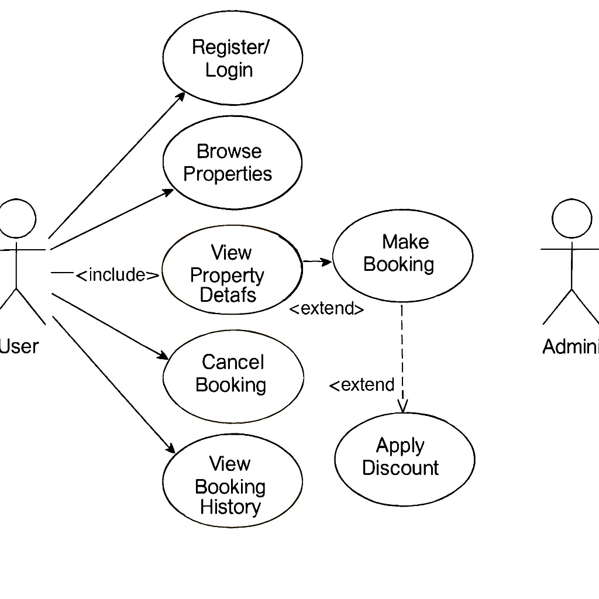

# Requirement Analysis in Software Development

This repository contains a detailed requirement analysis for a Booking Management System project, covering functional and non-functional requirements, use cases, and acceptance criteria.

## What is Requirement Analysis?

Requirement Analysis is the process of identifying, understanding, and documenting the needs and expectations of stakeholders for a software system. 
It ensures the system meets business objectives, aligns with user needs, and minimizes errors during development. 
Requirement Analysis is a critical phase in the Software Development Life Cycle (SDLC), bridging the gap between business ideas and technical implementation.

## Why is Requirement Analysis Important?

- **Clarity and Understanding:** Clearly defines what needs to be developed and avoids misunderstandings.
- **Risk Reduction:** Identifies potential issues early to prevent costly fixes during development.
- **Resource Management:** Helps prioritize features, allocate budget, time, and effort effectively.
- **Stakeholder Alignment:** Ensures that developers, clients, and users agree on system requirements.

## Key Activities in Requirement Analysis

- **Requirement Gathering:** Collecting stakeholder needs through interviews, surveys, and workshops.
- **Requirement Elicitation:** Extracting detailed requirements by analyzing business processes and asking the right questions.
- **Requirement Documentation:** Recording requirements in a clear, structured format for reference and development.
- **Requirement Analysis and Modeling:** Analyzing requirements for conflicts, feasibility, and creating models like diagrams or flowcharts.
- **Requirement Validation:** Ensuring that requirements are complete, accurate, and approved by stakeholders.

## Types of Requirements

### Functional Requirements
Functional requirements define what the system should do.

**Examples for Booking Management System:**
- Users can create a booking.
- Users can cancel a booking.
- Admin can approve or reject bookings.
- Users can view booking history.

### Non-Functional Requirements
Non-functional requirements define how the system should perform.

**Examples:**
- Page load time should be under 2 seconds.
- The system must handle 500 concurrent users.
- User data must be encrypted.
- System must be available 24/7.

## Use Case Diagrams

Use Case Diagrams visually represent interactions between system actors and the system itself. 
They help stakeholders and developers understand system functionality and responsibilities clearly.

**Example Use Case Diagram for Booking Management System:**

## Acceptance Criteria

Acceptance Criteria are the conditions a feature must meet to be considered complete and approved.

**Example for Checkout Feature:**
- User can select booking dates and times.
- Payment gateway processes payments securely.
- Confirmation email is sent after successful booking.
- Feature works on both desktop and mobile devices.
